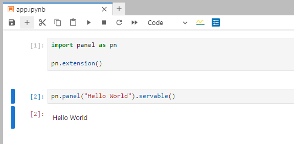
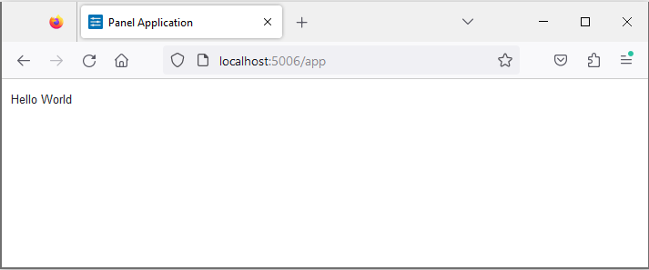

# Build Hello World App

In this tutorial, we will develop and *serve* a *Hello World* Panel:

- Serve the app with `panel serve app.py`, `panel serve app.ipynb`, or `panel serve app.md`.
- serve with auto reload by adding the flag `--autoreload`.
- stop your server with `CTRL+C`.

## Serve the App

Select a *tab* below and continue

:::::{tab-set}

::::{tab-item} Python Script
:sync: script

The simplest Panel `.py` app could look like this:

```python
import panel as pn

pn.extension()

pn.panel("Hello World").servable()
```

:::{note}
The code refers to

- `panel`: The Panel python package. It's a convention to import it as `pn`.
- `pn.extension()`: Loads javascript dependencies and configures Panel.
- `pn.panel(...)`: Creates a *displayable* Panel component.
- `.servable()`: Displays the component in a *server app*.
:::

Copy the code into a file named `app.py`.

Save the file.

Run the Panel server in your terminal with

```bash
panel serve app.py --autoreload
```

When the server has started, the terminal output should look like this

```bash
$ panel serve app.py --autoreload
2024-01-17 15:49:11,443 Starting Bokeh server version 3.3.2 (running on Tornado 6.3.3)
2024-01-17 15:49:11,444 User authentication hooks NOT provided (default user enabled)
2024-01-17 15:49:11,450 Bokeh app running at: http://localhost:5006/app
2024-01-17 15:49:11,450 Starting Bokeh server with process id: 47256
```

:::{note}
The command `panel serve app.py --autoreload` refers to:

- `panel`: the panel executable.
- `serve`: the command you want Panel to run
- `app.py`: the file `app.py` you want to serve
- `--autoreload`: make the server restart after code changes. Use this for **development only**.
:::

::::

::::{tab-item} Notebook
:sync: notebook

The simplest Panel Notebook app could look like this:

```python
import panel as pn

pn.extension()
```

```python
pn.panel("Hello World").servable()
```

:::{note}
The code refers to

- `panel`: The Panel python package. It's a convention to import it as `pn`.
- `pn.extension()`: **Loads the [`pyviz_comms`](https://github.com/holoviz/pyviz_comms) notebook extension**, loads javascript dependencies and configures Panel.
- `pn.panel(...)`: Creates a *displayable* Panel component. **The component can be displayed directly in the notebook**.
- `.servable()`: Displays the component in a *server app*.
:::

Copy the 2 code cells above into a clean notebook named `app.ipynb`.

Run the cells in the notebook and save it as `app.ipynb` if you have not already done it.

It should look like

.

Run the Panel server in your terminal with

```bash
panel serve app.ipynb --autoreload
```

When the server has started, the terminal output should look like this

```bash
$ panel serve app.ipynb --autoreload
2024-01-17 21:05:32,338 Starting Bokeh server version 3.3.3 (running on Tornado 6.4)
2024-01-17 21:05:32,339 User authentication hooks NOT provided (default user enabled)
2024-01-17 21:05:32,342 Bokeh app running at: http://localhost:5006/app
2024-01-17 21:05:32,342 Starting Bokeh server with process id: 42008
```

:::{note}
The command `panel serve app.ipynb --autoreload` refers to:

- `panel`: the panel executable.
- `serve`: the command you want Panel to run
- `app.ipynb`: the file `app.ipynb` you want to serve
- `--autoreload`: make the server restart after code changes. Use this for **development only**.
:::

::::

::::{tab-item} Markdown File
:sync: markdown

The simplest Panel `.md` app could look like this:

````markdown
```python
import panel as pn

pn.extension

pn.panel("Hello World").servable()
```
````

:::{note}
The code refers to

- `panel`: The Panel python package. It's a convention to import it as `pn`.
- `pn.extension()`: Loads javascript dependencies and configures Panel.
- `pn.panel(...)`: Creates a *displayable* Panel component.
- `.servable()`: Displays the component in a *server app*.
:::

Copy the code into a file named `app.md`.

Save the file.

Run the Panel server in your terminal with

```bash
panel serve app.md --autoreload
```

When the server has started, the terminal output should look like this

```bash
$ panel serve app.md --autoreload
2024-02-03 17:13:55,444 Starting Bokeh server version 3.3.3 (running on Tornado 6.4)
2024-02-03 17:13:55,446 User authentication hooks NOT provided (default user enabled)
2024-02-03 17:13:55,448 Bokeh app running at: http://localhost:5006/app
2024-02-03 17:13:55,448 Starting Bokeh server with process id: 34596
```

:::{note}
The command `panel serve app.py --autoreload` refers to:

- `panel`: the panel executable.
- `serve`: the command you want Panel to run
- `app.md`: the file `app.md` you want to serve
- `--autoreload`: make the server restart after code changes. Use this for **development only**.
:::

::::

:::::

In the output, you will find the line

```bash
Bokeh app running at: http://localhost:5006/app
```

That line shows the URL where your app is being served, on your local machine.

:::{note}
The `Bokeh server` is mentioned because Panel is built on top of [Bokeh](https://docs.bokeh.org).
:::

Open your browser at [http://localhost:5006/app](http://localhost:5006/app).

The application will look like.

.

Try changing `"Hello World"` to `"World Hello"`.

Save the file. The application will automatically reload and show the updated text.

Now stop the server by pressing `CTRL+C` one or more times in the terminal.

## Recap

Congratulations. We have just served our first Panel app. Along the way, we have learned to

- serve a Python script, Notebook or Markdown file with the commands `panel serve app.py`, `panel serve app.ipynb` or `panel serve app.md` respectively.
- serve with *auto reload* by adding the flag `--autoreload`.
- stop the Panel server with `CTRL+C`.

## Resources

### Tutorials

- [Serve Panel Apps (Intermediate)](../intermediate/serve.md)

### How-to

- [Launch a server dynamically with `pn.serve` or `pn.show`](../../how_to/server/programmatic.md)
- [Launch a server on the commandline](../../how_to/server/commandline.md)
- [Migrate from Streamlit | Serve Apps](../../how_to/streamlit_migration/index.md)
- [Serve multiple applications with `pn.serve`](../../how_to/server/multiple.md)
- [Serve static files with `--static-dirs`](../../how_to/server/static_files.md)
- [Serve with Django](../../how_to/integrations/Django.md)
- [Serve with FastAPI](../../how_to/integrations/FastAPI.md)
- [Serve with Flask](../../how_to/integrations/flask.md)
- [Write and serve apps in Markdown](../../how_to/editor/markdown.md)
