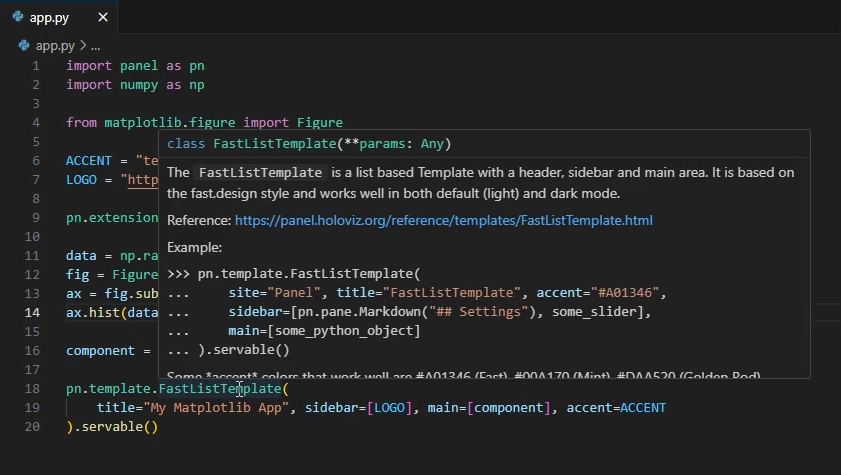
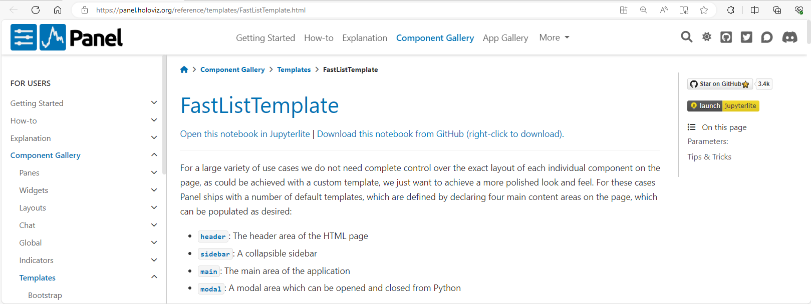

# Develop in an Editor

In this section you will learn the basics of developing Panel apps in an editor:

- serve your app with *autoreload* using `panel serve app.py --autoreload`
- display the app in a *simple* browser tab inside your editor if possible
- Inspect Panel objects via *hover* and `print`
- Inspect a components parameters via `.param` and `.param._repr_html_()`

:::{admonition} Note
Some of the features demonstrated in this guide might require special configuration of your editor. For configuration we refer you to the [Resources](#resources) section below and general resources on the web.
:::

## Install the Dependencies

Please make sure [Matplotlib](https://matplotlib.org/) and [Numpy](https://numpy.org/) are installed.

::::{tab-set}

:::{tab-item} conda
:sync: conda

``` bash
conda install -y -c conda-forge matplotlib numpy
```
:::

:::{tab-item} pip
:sync: pip

``` bash
pip install matplotlib numpy
```
:::

::::

## Serve your app with autoreload

A simple Panel app could look like the below.

```python
import panel as pn
import numpy as np

from matplotlib.figure import Figure

ACCENT = "goldenrod"
LOGO = "https://assets.holoviz.org/panel/tutorials/matplotlib-logo.png"

pn.extension(sizing_mode="stretch_width")

data = np.random.normal(1, 1, size=100)
fig = Figure(figsize=(8,4))
ax = fig.subplots()
ax.hist(data, bins=20, color=ACCENT)

component = pn.pane.Matplotlib(fig, format='svg', sizing_mode='scale_both')

pn.template.FastListTemplate(
    title="My App", sidebar=[LOGO], main=[component], accent=ACCENT
).servable()
```

Copy the code above into a file named `app.py`.

Save the file if you have not already done it.

Serve the app by running the below command in a terminal.

```bash
panel serve app.py --autoreload
```

It should look like

```bash
$ panel serve app.py --autoreload
2024-01-20 07:49:06,767 Starting Bokeh server version 3.3.3 (running on Tornado 6.4)
2024-01-20 07:49:06,769 User authentication hooks NOT provided (default user enabled)
2024-01-20 07:49:06,771 Bokeh app running at: http://localhost:5006/app
2024-01-20 07:49:06,771 Starting Bokeh server with process id: 22100
```

Open [http://localhost:5006/app](http://localhost:5006/app) in a browser.

It should look like


Now change the

- `ACCENT` value to `teal` and save the `app.py` file.
- `bins` value to `15` and save
- `title` value to `"My Matplotlib App"` and save

It should look like

<video controls="" poster="../../_static/images/develop_editor_panel_serve_after.png">
    <source src="https://assets.holoviz.org/panel/tutorials/develop_editor_serve_app.mp4" type="video/mp4" style="max-height: 400px; max-width: 100%;">
    Your browser does not support the video tag.
</video>

:::{admonition} Note
In the video above you will notice that the app is displayed inside the editor. This feature is supported in VS Code as the *simple browser*. PyCharm supports a similar feature via an extension.
:::

:::{admonition} Note
You should only serve your apps with `--autoreload` while developing
:::

Stop the Panel server by sending a termination signal. In most terminal environments, you can do this by pressing `CTRL+C` one or more times.

## Inspect Panel objects via hover

Copy the code below into a file named `app.py`.

```python
import panel as pn
import numpy as np

from matplotlib.figure import Figure

ACCENT = "teal"
LOGO = "https://s3.eu-west-1.amazonaws.com/assets.holoviz.org/panel/tutorials/matplotlib-logo.png"

pn.extension(sizing_mode="stretch_width")

data = np.random.normal(1, 1, size=100)
fig = Figure(figsize=(8,4))
ax = fig.subplots()
ax.hist(data, bins=15, color=ACCENT)

component = pn.pane.Matplotlib(fig, format='svg', sizing_mode='scale_both')

pn.template.FastListTemplate(
    title="My Matplotlib App", sidebar=[LOGO], main=[component], accent=ACCENT
).servable()
```

Save the file if you have not already done it.

Hover over the word `FastListTemplate`.

It would look something like



:::{admonition} Note
The tooltip of Panel components normally provide an *example* code snippet and a *Reference* link. The *Reference* link makes it very easy to navigate to the reference guides on the Panel web site for more information.
:::

:::{admonition} Note
If your editor does not show any tooltips, then please refer to your editors documentation to figure out how to enable it.
:::

Hover again and click the *Reference* link <a href="https://panel.holoviz.org/reference/templates/FastListTemplate.html" target="_blank">https://panel.holoviz.org/reference/templates/FastListTemplate.html</a>.

This should open the `FastListTemplate` reference guide

[](https://panel.holoviz.org/reference/templates/FastListTemplate.html)

:::{admonition} Note
It is a great idea to use the *Example* code snippets and *Reference* links to speed up your workflow.
:::

## Inspect components via `print`

Copy the code below into a file named `app.py`.

```python
import panel as pn

pn.extension(design="material")

component = pn.panel("Hello World")
print(component)
layout = pn.Column(
    component, pn.widgets.IntSlider(value=2, start=0, end=10, name="Value")
)
print(layout)
layout.servable()
```

Save the file if you have not already done it.

Serve the app by running the below command in a terminal.

```bash
panel serve app.py --autoreload
```

Open [http://localhost:5006/app](http://localhost:5006/app) in a browser.

This will look something like the below in the terminal.

```bash
$ panel serve app.py --autoreload
Markdown(str, design=<class 'panel.theme.materi...)
Column(design=<class 'panel.theme.materi...)
    [0] Markdown(str, design=<class 'panel.theme.materi...)
    [1] IntSlider(design=<class 'panel.theme.materi..., end=10, name='Value', value=2)
2024-01-20 08:05:21,789 Starting Bokeh server version 3.3.3 (running on Tornado 6.4)
2024-01-20 08:05:21,791 User authentication hooks NOT provided (default user enabled)
2024-01-20 08:05:21,793 Bokeh app running at: http://localhost:5006/app
2024-01-20 08:05:21,794 Starting Bokeh server with process id: 11092
Markdown(str, design=<class 'panel.theme.materi...)
Column(design=<class 'panel.theme.materi...)
    [0] Markdown(str, design=<class 'panel.theme.materi...)
    [1] IntSlider(design=<class 'panel.theme.materi..., end=10, name='Value', value=2)
2024-01-20 08:05:25,768 WebSocket connection opened
2024-01-20 08:05:25,768 ServerConnection created
```

:::{admonition} Note
By printing *layout* components like `Column` you can understand how they are composed. This enables you to *access* the subcomponents of the layout.
:::

Replace `layout.servable()` with `layout[0].servable()` and save the file.

This will look like

![Layout[0]](../../_static/images/develop_editor_layout0.png)

Replace `layout[0].servable()` with `layout[1].servable()` and save the file.

This will look like

![Layout[1]](../../_static/images/develop_editor_layout1.png)

## Inspect component Parameters via `.param`

You can inspect the *parameters* of Panels components via the `.param` namespace and its `._repr_html_` method.

Replace the content of your `app.py` file with

```python
import panel as pn

pn.extension(design="material")

component = pn.panel("Hello World")

pn.Row(
    component.param, pn.pane.HTML(component.param._repr_html_())
).servable()
```

Serve the app with `panel serve app.py --autoreload`.

Open [http://localhost:5006](http://localhost:5006) in a browser.

It should look like


## Recap

You have learned to

- serve your app with *autoreload* using `panel serve app.py --autoreload`
- display the app in a *simple* browser tab inside your editor if possible
- Inspect Panel objects via *hover* and `print`
- Inspect a components parameters via `.param` and `.param._repr_html_()`

## Resources

### Tutorials

- [Develop in an Editor (Intermediate)](../intermediate/develop_editor.md)

### How-to

- [Configure VS Code](../how_to/editor/vscode_configure.md)
- [Write apps in Markdown](../how_to/editor/markdown.md)
