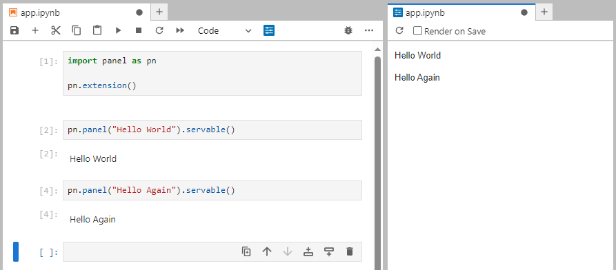
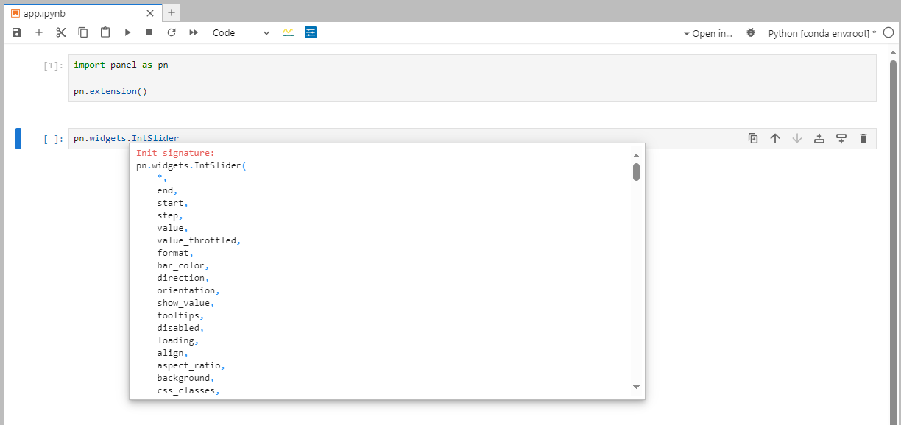
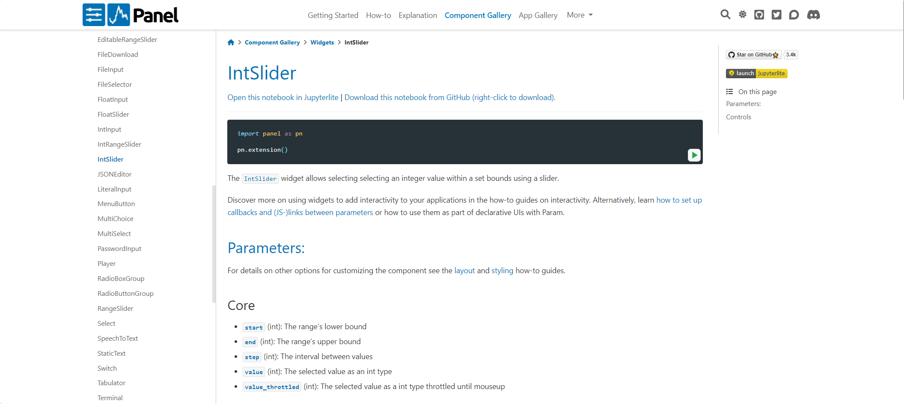

# Develop in a Notebook

In this guide you will learn how to develop efficiently in a notebook:

- Preview your app in Jupyter lab with the *Panel Jupyter Preview*.
- Inspect your component using `SHIFT+Tab` and `print`.
- Inspect your components parameters using `.param`.

:::note
In this guide we will assume you are working in [Jupyter lab](https://jupyter.org/). Panel works in many other notebook environments. But non-jupyterlab notebook environments might need special configuration before supporting Panel appropriately. Check out the [Resources](#resources) section below for more specific information for non-jupyterlab environments.
:::

## Preview your app

A simple notebook file containing a Panel app could look like

Start jupyterlab by running `jupyter lab` in the terminal.

Create the same notebook and run it.

:::note
The lines in the `app.ipynb` file refer to

- `panel`: The Panel python package. Its a convention to import it as `pn`.
- `pn.extension()`: **Loads the [`pyviz_comms`](https://github.com/holoviz/pyviz_comms) notebook extension**, loads javascript dependencies and configures Panel.
- `pn.panel(...)`: Creates a *displayable* Panel component. **The component can be displayed directly in the notebook**.
- `.servable()`: Displays the component in a *server app*.
:::

The little, blue Panel icon above the notebook will launch a *preview* of your app. We call this icon the *Panel Jupyter Preview* icon.

Click the *Panel Jupyter Preview* icon.

You will see the app launching in a separate window on the right.

You will notice that "Hello Again" is not displayed in the app preview. That is because `pn.panel("Hello Again")` has not been added to the app. You can do that by marking it `.servable()`.

Change the cell to `pn.panel("Hello Again).servable()`.

Click the *refresh* button in the *Panel Jupyter Preview*. Its located left of the *Render on Save* check box.

Your *preview* will update and look like

To enable a more efficient workflow you can check the *Render on Save* checkbox. This will *auto reload* your app when the notebook is saved.

Check the *Render on Save* checkbox.

Change the cell to `pn.panel("Hello Again and Again.).servable()`.

The app will automatically reload and look like

Watch the video below to see how the techniques above can be used to develop a more advanced app.

<video controls="" poster="../_static/images/jupyter_panel_preview_in_action.png">
    <source src="https://private-user-images.githubusercontent.com/42288570/297636556-d3db43c2-b09b-40b8-89a1-009d297e9833.mp4?jwt=eyJhbGciOiJIUzI1NiIsInR5cCI6IkpXVCJ9.eyJpc3MiOiJnaXRodWIuY29tIiwiYXVkIjoicmF3LmdpdGh1YnVzZXJjb250ZW50LmNvbSIsImtleSI6ImtleTUiLCJleHAiOjE3MDU1NTgyNDUsIm5iZiI6MTcwNTU1Nzk0NSwicGF0aCI6Ii80MjI4ODU3MC8yOTc2MzY1NTYtZDNkYjQzYzItYjA5Yi00MGI4LTg5YTEtMDA5ZDI5N2U5ODMzLm1wND9YLUFtei1BbGdvcml0aG09QVdTNC1ITUFDLVNIQTI1NiZYLUFtei1DcmVkZW50aWFsPUFLSUFWQ09EWUxTQTUzUFFLNFpBJTJGMjAyNDAxMTglMkZ1cy1lYXN0LTElMkZzMyUyRmF3czRfcmVxdWVzdCZYLUFtei1EYXRlPTIwMjQwMTE4VDA2MDU0NVomWC1BbXotRXhwaXJlcz0zMDAmWC1BbXotU2lnbmF0dXJlPTQ3MDM5OGMwOWNiZmVkMDMwNzFhOTllODIzMTYxMjIzOWY1NzQ1MGE2MWU1N2RlZjNlNmQ4MTQzMTU1NWRiN2YmWC1BbXotU2lnbmVkSGVhZGVycz1ob3N0JmFjdG9yX2lkPTAma2V5X2lkPTAmcmVwb19pZD0wIn0.gqh0mpR_qJQTQkUrWJBkjzwZbxufiW5RWTeKDKnXoZk" type="video/mp4" style="max-height: 400px; max-width: 100%;">
    Your browser does not support the video tag.
</video>

## Inspect a Component using `SHIFT+Tab`

Write `pn.widgets.IntSlider` in a cell and press `SHIFT+Tab`.

It should look like

Scroll down until you find the *Reference* link

:::info
You can copy paste and use the *Example* and/ or click the *Reference* link. This can really speed up your workflow.
:::

Try opening the *Reference* link [https://panel.holoviz.org/reference/widgets/IntSlider.html](https://panel.holoviz.org/reference/widgets/IntSlider.html) to find more information about the `IntSlider`.

It should look like

## Inspect a Component using `print`

Try printing a `pn.panel` and a `pn.Column` in a notebook.

It should look like

Printing *layout* components like `Column` can be especially valuable as you can see which components they contain and how to access them.

Try accessing the `IntSlider` with index 1 by running `component[1]`.

It should look like

## Inspect a Components Parameters using `.param`

Try inspecting the *parameters* of a `pn.widgets.IntSlider` *class* and *instance* by running `pn.widgets.IntSlider.param` or `pn.widgets.IntSlider(align="end").param` in a notebook.

It should look like

Please note

- In the left `app.ipynb` notebook you see the *default* parameter values of the `IntSlider` class. I.e. the *default* value of `align` is `'start'`.
- In the right `app2.ipynb` notebook you see *actual* parameter values of the `IntSlider` instance. I.e. the *actual* value of `align` is `'end'`.
- The tables gives you additional information like the `Type` and `Range` of the Parameter.

## Recap

You can

- Preview your app in Jupyter lab with the *Panel Jupyter Preview*.
- Inspect your component using `SHIFT+Tab` and `print`.
- Inspect your components parameters using `.param`.

## Resources

### How-to

- [Develop in other notebook environments](../how_to/notebook/notebook.html)
- [Display Output in Notebooks](../how_to/notebook/notebook.html)
- [Preview Apps in Jupyterlab](../how_to/notebook/jupyterlabpreview.md)
- [Serve an app from a notebook file](serve.md)
- [Use VS Code Notebook and Interactive Environment](../how_to/editor/vscode_configure.html#notebook-and-interactive-environment)
